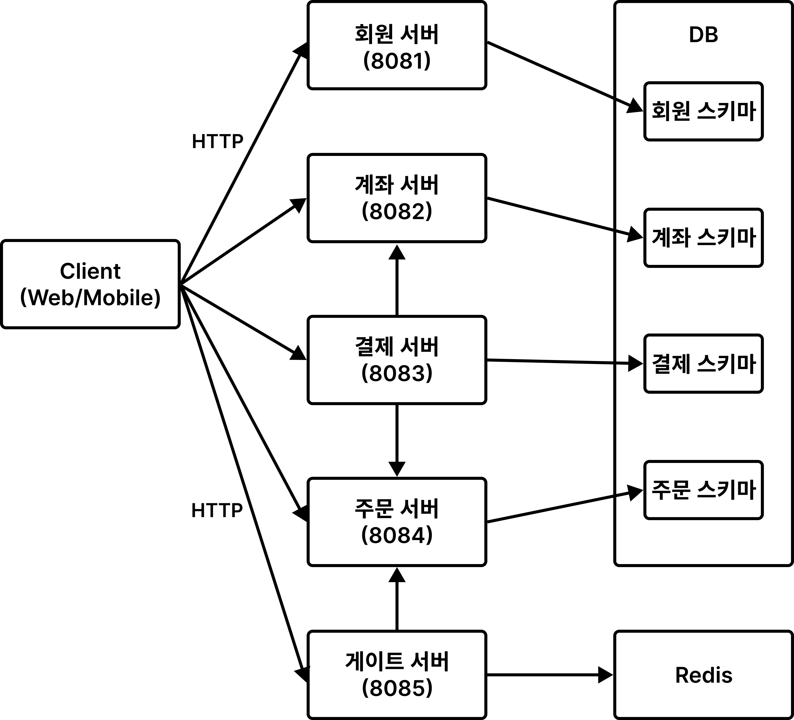

# Sunday

한정 수량 상품의 선착순 주문 및 결제 시스템입니다.

주문이 짧은 시간에 몰려도 **초과 판매 없이**, **주문 서버가 감당할 만큼만 요청을 받고**, **결제 도중 장애가 나도 금액과 주문이 어긋나지 않게** 처리하는 것을 목표로 만들었습니다.

---

## 아키텍처



도메인별 API를 각각 독립 실행 가능한 Spring Boot 애플리케이션으로 분리했습니다.

| 서버 | 포트 | 역할 | 저장소 |
|---|---|---|---|
| Member | 8081 | 회원 | PostgreSQL |
| Account | 8082 | 계좌 / 송금 | PostgreSQL |
| Payment | 8083 | 결제 | PostgreSQL |
| Order | 8084 | 주문 / 재고 | PostgreSQL |
| Gate | 8085 | 주문 토큰 발급 | Redis |

하나의 PostgreSQL을 공유하지만 애플리케이션 계정마다 자기 스키마 권한만 부여했습니다. 다른 도메인의 데이터가 필요하면 해당 API를 호출하며, 다른 서비스의 테이블을 직접 조회하지 않습니다.

| API | DB 계정 | 스키마 | 소유 테이블 |
|---|---|---|---|
| Member | `member_app` | `member_service` | `member` |
| Account | `account_app` | `account_service` | `account`, `account_transaction`, `transfer` |
| Payment | `payment_app` | `payment_service` | `payment` |
| Order | `order_app` | `order_service` | `product`, `product_stock`, `order_reservations`, `orders` |

---

## 주문 흐름

```
① 토큰 요청    Client ─▶ Gate ─┬─ 재고 있음 → 토큰 발급
                                └─ 재고 없음 → 품절 (주문 서버까지 가지 않음)

② 주문         Client ─▶ Order   토큰 서명 검증 → 재고 행 선점 → 예약(10분)

③ 결제         Client ─▶ Payment ─┬─ 성공 → 주문 확정
                                  └─ 실패 → 예약 취소, 재고 복구
```

재고를 잡았다고 판매가 확정된 것은 아닙니다. 예약은 10분 시한부이고, 결제에 실패하거나 시간이 지나면 재고가 다시 판매 가능 상태로 돌아옵니다.

---

## 핵심 설계

### 재고를 수량 컬럼이 아닌 개별 행으로 관리

상품 재고를 `product.stock_count` 하나로 관리하면 모든 주문이 같은 행을 잠그고 기다립니다. 락 종류를 바꿔도 하나의 행에 요청이 집중되는 구조는 그대로였습니다.

판매 수량만큼 `product_stock` 행을 만들고 `FOR UPDATE SKIP LOCKED`로 판매 가능한 행 하나를 선점하게 했습니다. 이미 점유된 행은 기다리지 않고 건너뜁니다.

| 항목 | 비관적 락 | SKIP LOCKED |
|---|---:|---:|
| 주문 p95 | 3,823 ms | **115 ms** |
| 주문 성공 | 100건 | 100건 |
| 초과 판매 | 0건 | 0건 |

### 주문 서버 앞에 게이트를 두어 유입 제한

재고가 소진된 뒤의 요청도 품절 여부를 확인하려면 DB까지 도달해야 했습니다. Redis Streams 대기열로 완충해 봤지만, 완충은 부하를 미룰 뿐 DB가 처리할 요청 수를 줄이지는 못했습니다.

주문 서버 앞에 게이트 서버를 두고 재고만큼만 통과시킵니다. 통과한 요청에는 서명된 토큰을 발급하고 주문 서버는 서명만 검증하므로, 두 서버가 저장소를 공유하거나 서로를 호출하지 않습니다.

| 항목 | 접수 큐 | 게이트 |
|---|---:|---:|
| 주문 서버 도달 요청 | 1,001건 | **100건** |
| 사용자가 결과를 아는 시점 | 21.9초 | **0.3초** |
| 초과 판매 | 0건 | 0건 |

발급 가능 수량은 스케줄러가 주기마다 `재고 − 주문 진행 중인 요청 수`로 다시 계산합니다. 요청을 처리하는 중에는 재고를 다시 읽지 않고 차감만 하기 때문에, 갱신 시점이 다른 값이 섞여 재고보다 많이 통과하는 일이 없습니다.

재고의 원본은 PostgreSQL이고 Redis 값은 매 주기 다시 계산되는 복사본입니다. 어긋나더라도 다음 주기에 맞춰지며, 최종 판정은 언제나 주문 서버의 `SKIP LOCKED`가 합니다.

### 결제를 단계별 상태로 저장해 실패 지점부터 재시도

결제 서버는 계좌 차감과 주문 확정을 서로 다른 서버에 요청하므로 하나의 트랜잭션으로 묶을 수 없습니다. 계좌 차감만 성공하면 금액은 빠져나갔는데 주문은 확정되지 않는 부분 성공이 생깁니다.

외부 API 호출을 DB 트랜잭션 밖에서 실행하고, 응답을 확인한 뒤 짧은 로컬 트랜잭션으로 다음 상태를 기록합니다.

```
PROCESSING → ACCOUNT_DEBITED → ORDER_CONFIRMED → COMPLETED
                                                → FAILED
환불: REFUND_PROCESSING → REFUNDED
```

응답을 받지 못하면 실패로 단정하지 않고 계좌 거래 내역과 주문 상태를 다시 조회해, **각 서비스에 실제로 저장된 상태**를 기준으로 다음 동작을 정합니다. 계좌 차감과 보상 입금에는 고정된 작업 식별 키를 사용해 재시도해도 중복 반영되지 않습니다.

### 계좌 입출금 멱등성

거래마다 호출자가 지정한 요청 식별 키를 저장하고 부분 유니크 인덱스로 중복 저장을 차단합니다. 계좌 행을 비관적 락으로 잠근 뒤 기존 거래를 조회해, 이미 처리된 키면 추가 반영 없이 현재 상태를 반환합니다. 같은 키인데 거래 유형이나 금액이 다르면 거절합니다.

---

## 기술 스택

| 구분 | 사용 |
|---|---|
| Language | Kotlin 2.3, JDK 21 |
| Framework | Spring Boot 4.0 |
| Database | PostgreSQL 17 |
| Cache / Queue | Redis 7 |
| Persistence | Spring Data JPA, QueryDSL |
| Testing | JUnit 5, MockK, Testcontainers |
| Load Test | k6 |
| Infra | Docker Compose |

---

> 위 표는 3회 측정의 중앙값입니다. 측정 환경과 회차별 원자료, 한계는
> [측정 기록](docs/benchmark.md)에 정리했습니다.
